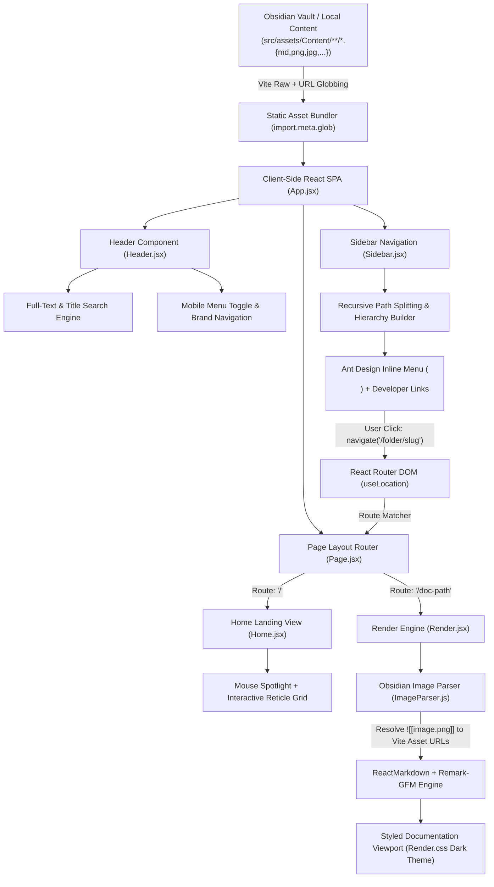

# CodeJournal — Technical Documentation & Architecture Specification

**CodeJournal** is a personal documentation and project publishing platform designed as an automated, zero-backend **Markdown-to-Web pipeline**. It enables developers to author notes locally using Obsidian or any standard Markdown editor, organize documentation in nested directories, and have those files—along with embedded images and technical notes—instantly rendered into a modern, high-aesthetic web application.

- **Live Production URL**: [https://abhay-codejournal.netlify.app/](https://abhay-codejournal.netlify.app/)
- **GitHub Repository**: [https://github.com/MONARCH1108/CodeJournal.git](https://github.com/MONARCH1108/CodeJournal.git)

---

## 1. Problem Statement

> *"I document my projects using Markdown and Obsidian, but publishing and maintaining that documentation through platforms like Medium gives me limited control over how my content is stored, organized, presented, and deployed. I want a system where I can write documentation locally, organize it project-wise, and automatically turn those Markdown files and their associated images into a publicly accessible website."*

CodeJournal solves this by acting as a direct bridge between local file systems and modern client-side web rendering, ensuring complete ownership over content structure, aesthetic styling, and deployment workflows.

---

## 2. Architecture & The Obsidian-to-Site Data Flow

The entire platform operates on an automated static bundling pipeline that bridges local Obsidian authoring with client-side React rendering:



---

## 3. End-to-End Data Flow Pipeline (Step-by-Step)

The documentation platform executes an automated 6-stage lifecycle to turn local Obsidian notes into live web pages:

```text
Local Obsidian Vault  ──>  Vite Eager Globbing  ──>  Hierarchy & Search Index  ──>  Route Matcher  ──>  Wikilink Parser  ──>  DOM Render
  (src/assets/Content)     (?raw & ?url maps)         (AntD Tree + Search Modal)      (Page.jsx)          (ImageParser.js)       (ReactMarkdown)
```

### Stage 1: Local Note Authoring & Vault Sync
- Notes, technical sheets, and guides are written locally as `.md` files inside nested subfolders within `src/assets/Content/`.
- Screenshots and diagrams pasted directly in Obsidian are automatically saved into local image folders (e.g. `images/` or `Images/`).
- The directory contains native `.obsidian/` configuration files (`app.json`, `workspace.json`, `core-plugins.json`), making `src/assets/Content/` an official Obsidian vault.

### Stage 2: Static Asset Ingestion & Compile-Time Bundling
- Vite statically analyzes and bundles all Markdown and media assets at build time via `import.meta.glob`:
  - **Raw Markdown Text**:
    ```javascript
    const files = import.meta.glob("../assets/Content/**/*.md", {
        query: "?raw",
        import: "default",
        eager: true,
    });
    ```
  - **Hashed Image Asset URLs**:
    ```javascript
    const images = import.meta.glob("../assets/Content/**/*.{png,jpg,jpeg,gif,svg,webp}", {
        eager: true,
        query: "?url",
        import: "default",
    });
    ```

### Stage 3: Dynamic Menu Tree Generation & Search Indexing
- **Sidebar Hierarchy (`Sidebar.jsx`)**:
  - Splits each file path relative to `Content/` into folder segments.
  - Recursively constructs an Ant Design `<Menu mode="inline" />` data tree with `FiFolder` icons for directories and `FiFileText` icons for individual notes.
  - Automatically adapts to any directory depth without hardcoded route files.
- **Search Engine (`Header.jsx`)**:
  - Eagerly indexes all loaded files to enable instant, zero-latency search matching across both file titles (`fileName.toLowerCase()`) and raw document text (`content.toLowerCase()`).

### Stage 4: Dynamic Route Resolution (`Page.jsx`)
- When a user selects a menu item or search result, React Router navigates to the nested document path (e.g., `/{category}/{subcategory}/{note}`).
- `Page.jsx` listens to route changes via `useLocation()`:
  - If `location.pathname === "/"`, it mounts the interactive `<Home />` landing screen.
  - Otherwise, it extracts and decodes the pathname slug, looks up the corresponding Markdown string in the eager file cache, and passes it to `<Render />`.

### Stage 5: Obsidian Wikilink Image Preprocessing (`ImageParser.js`)
- Standard Markdown renderers fail to display Obsidian wikilink image tags (e.g. `![[Pasted image 20250411165743.png]]`).
- `Render.jsx` passes the raw Markdown string to `ImageParser.js`:
  ```javascript
  function parseImages(content) {
      return content.replace(/!\[\[(.*?)\]\]/g, (_, image) => {
          const imageName = image.trim();
          const imagePath = Object.keys(images).find((path) =>
              path.endsWith(`/${imageName}`)
          );
          return imagePath
              ? ``
              : `})`;
      });
  }
  ```
- This dynamically converts all wikilink images into standard Markdown image tags pointing to Vite's hashed asset URLs.

### Stage 6: Markdown DOM Rendering & Typography Output
- `Render.jsx` feeds the preprocessed content into `ReactMarkdown` with the `remark-gfm` plugin.
- Applies refined dark luxury typography styles (`Render.css`):
  - Editorial serif headings (`Source Serif 4`)
  - Styled monospace code blocks (`JetBrains Mono`)
  - Gold-accented blockquotes (`#c9a96e`)
  - Zebra-striped data tables with dark border grids
  - Custom dark scrollbars and responsive image frames

---

## 4. Tech Stack & Dependencies

| Layer | Technology | Purpose |
|---|---|---|
| **Frontend Framework** | React 19 (`^19.2.8`) + Vite 8 (`^8.2.0`) | Modern SPA runtime with Hot Module Replacement and compile-time asset globbing |
| **UI Components** | Ant Design 6.6 (`antd ^6.6.1`) | Hierarchical collapsible sidebar menu (`<Menu mode="inline" />`) |
| **Iconography** | React Icons 5.7 (`react-icons ^5.7.0`) | Feather icons (`react-icons/fi`) for navigation, search, social links, and folders |
| **Routing** | React Router DOM 7.18 (`react-router-dom ^7.18.2`) | Client-side routing, deep directory slug matching, and homepage switching |
| **Markdown Parser** | React Markdown 10.1 (`react-markdown ^10.1.0`) | Converts parsed Markdown AST strings into React virtual DOM elements |
| **Markdown Extensions** | Remark GFM 4.0 (`remark-gfm ^4.0.1`) | Adds GitHub Flavored Markdown support (tables, checklists, autolinks, strikethrough) |
| **Image Resolution** | Custom Regex Parser (`ImageParser.js`) | Dynamic resolver mapping Obsidian `![[image.png]]` wikilinks to bundled Vite asset URLs |
| **Content Vault** | Obsidian Vault (`src/assets/Content/`) | Local Markdown note authoring environment with `.obsidian` configurations |
| **Design System** | Refined Dark Editorial System | CSS custom properties, gold accents (`#c9a96e`), Google Fonts (`Source Serif 4`, `JetBrains Mono`, `IBM Plex Sans`) |
| **Deployment & CI/CD** | Netlify + GitHub Actions | Automated continuous integration and static site hosting on push to `main` |

---

## 5. Core Frontend Components

| Component | File Path | Responsibilities & Implementation Details |
|---|---|---|
| `App.jsx` | `src/App.jsx` | Coordinates `<Header />`, mobile drawer state (`sidebarOpen`), and the split-screen `<main-layout>` container under `<BrowserRouter>`. |
| `Header.jsx` | `src/Header/Header.jsx` | Global fixed header with brand logo, mobile hamburger trigger (`FiMenu`), Home link (`FiHome`), GitHub link (`FiGithub`), and an instant modal search bar (`FiSearch`/`FiX`). |
| `Home.jsx` | `src/Home/Home.jsx` | Interactive landing screen with mouse tracking coordinates (`--x`, `--y`), dynamic radial mask overlay, `SYS.LOC` reticle crosshairs, developer bio, social links, and coordinate metadata stamp (`48.8566° N, 2.3522° E`). |
| `Sidebar.jsx` | `src/Sidebar/Sidebar.jsx` | Discovers content files, builds a recursive Ant Design tree menu with `FiFolder` and `FiFileText` icons, handles nested routing clicks, manages off-canvas mobile sliding, and renders developer social links. |
| `Page.jsx` | `src/Page/Page.jsx` | Route dispatcher that renders `<Home />` on `/` or extracts the URL slug via `useLocation()` and queries the globbed file cache for `<Render />`. |
| `Render.jsx` | `src/Render/Render.jsx` | Markdown presentation layer that invokes `ImageParser.js` and renders styled DOM elements via `ReactMarkdown` + `remark-gfm`. |
| `ImageParser.js` | `src/Parser/ImageParser.js` | Utility module using eager asset globbing and regex replacement to dynamically resolve Obsidian `![[image.png]]` wikilinks to hashed Vite URLs. |

---

## 6. Key Observations & Architectural Highlights

- **Zero-Backend Client-Side Execution**: Pure static single-page application requiring no server, database, or external API at runtime.
- **Direct Obsidian Vault Integration**: `src/assets/Content/` functions as an Obsidian vault (with `.obsidian/` configuration), allowing synchronous local editing and live web updates.
- **Instant Full-Text Client Search**: Header search filters both filenames and full note contents in memory with instant keystroke response.
- **Wikilink Image Parsing**: Solves the Obsidian-to-Web image resolution problem without manual markdown image path rewrites.
- **Deep Hierarchical Routing**: Supports arbitrary directory nesting depth while preserving clean, semantic URL paths.
- **Refined Dark Editorial Aesthetic**: Minimalist dark theme featuring warm gold accents (`#c9a96e`), serif editorial typography (`Source Serif 4`), monospaced code blocks (`JetBrains Mono`), and an interactive cursor-reactive landing canvas.
- **Mobile Responsive Drawer**: Off-canvas sidebar with backdrop blur overlay for seamless mobile and tablet navigation.
- **Automated CI/CD**: Live on Netlify with automated continuous deployment triggered on every commit to GitHub.