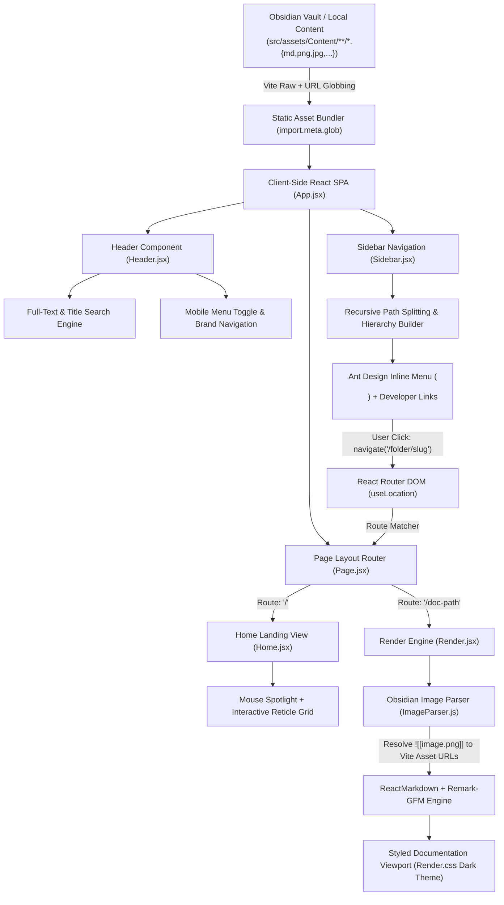

# CodeJournal — Technical Documentation & Architecture Specification

**CodeJournal** is a personal documentation and project publishing platform designed as an automated, zero-backend **Markdown-to-Web pipeline**. It enables developers to author notes locally using Obsidian or any standard Markdown editor, organize documentation in nested directories, and have those files—along with embedded images and technical notes—instantly rendered into a modern, high-aesthetic web application.

- **Live Production URL**: [https://abhay-codejournal.netlify.app/](https://abhay-codejournal.netlify.app/)
- **GitHub Repository**: [https://github.com/MONARCH1108/CodeJournal.git](https://github.com/MONARCH1108/CodeJournal.git)

---

## 1. Problem Statement

> *"I document my projects using Markdown and Obsidian, but publishing and maintaining that documentation through platforms like Medium gives me limited control over how my content is stored, organized, presented, and deployed. I want a system where I can write documentation locally, organize it project-wise, and automatically turn those Markdown files and their associated images into a publicly accessible website."*

CodeJournal solves this by acting as a direct bridge between local file systems and modern client-side web rendering, ensuring complete ownership over content structure, aesthetic styling, and deployment workflows.

---

## 2. Architecture (Markdown-to-Web Pipeline)

---

## 3. Tech Stack & Dependencies

| Layer | Technology | Purpose |
|---|---|---|
| **Frontend Framework** | React 19 (`^19.2.8`) + Vite 8 (`^8.2.0`) | Modern SPA runtime with Hot Module Replacement and compile-time asset globbing |
| **UI Components** | Ant Design 6.6 (`antd ^6.6.1`) | Hierarchical collapsible sidebar menu (`<Menu mode="inline" />`) |
| **Iconography** | React Icons 5.7 (`react-icons ^5.7.0`) | Feather icons (`react-icons/fi`) for navigation, search, social links, and folders |
| **Routing** | React Router DOM 7.18 (`react-router-dom ^7.18.2`) | Client-side routing, deep directory slug matching, and homepage switching |
| **Markdown Parser** | React Markdown 10.1 (`react-markdown ^10.1.0`) | Converts parsed Markdown AST strings into React virtual DOM elements |
| **Markdown Extensions** | Remark GFM 4.0 (`remark-gfm ^4.0.1`) | Adds GitHub Flavored Markdown support (tables, checklists, autolinks, strikethrough) |
| **Image Resolution** | Custom Regex Parser (`ImageParser.js`) | Dynamic resolver mapping Obsidian `![[image.png]]` wikilinks to bundled Vite asset URLs |
| **Content Vault** | Obsidian Vault (`src/assets/Content/`) | Local Markdown note authoring environment with `.obsidian` configurations |
| **Design System** | Refined Dark Editorial System | CSS custom properties, gold accents (`#c9a96e`), Google Fonts (`Source Serif 4`, `JetBrains Mono`, `IBM Plex Sans`) |
| **Deployment & CI/CD** | Netlify + GitHub Actions | Automated continuous integration and static site hosting on push to `main` |

---

## 4. End-to-End Data Flow (Pipeline)

1. **Local Authoring & Vault Sync**
   Technical notes, guides, and images are created locally in nested subfolders inside `src/assets/Content/` using the Obsidian desktop application.

2. **Static Asset Ingestion (Vite Globbing)**
   - Vite's `import.meta.glob("../assets/Content/**/*.md", { query: "?raw", import: "default", eager: true })` discovers and compiles all Markdown files as raw text strings.
   - Vite's `import.meta.glob("../assets/Content/**/*.{png,jpg,jpeg,gif,svg,webp}", { eager: true, query: "?url", import: "default" })` discovers and hashes all media assets.

3. **Hierarchical Tree & Search Indexing**
   - `Sidebar.jsx` parses file paths relative to `Content/`, splits path segments, and builds a recursive Ant Design `<Menu mode="inline" />` with custom folder/file icons.
   - `Header.jsx` builds a real-time full-text and title search index across all loaded documents.

4. **Dynamic Route Resolution**
   - `Page.jsx` inspects `location.pathname` via `useLocation()`.
   - If `pathname === "/"`, it mounts the interactive `<Home />` landing screen.
   - Otherwise, it decodes the URL slug and matches it against the bundled file paths (e.g., `/Node & Express/Notes-Node`).

5. **Obsidian Wikilink Image Preprocessing**
   - Before Markdown parsing, `Render.jsx` passes the raw string through `ImageParser.js`.
   - A regex matcher `/!\[\[(.*?)\]\]/g` extracts the image filename, finds the corresponding hashed asset path, and transforms it into standard Markdown syntax: ``.

6. **Markdown DOM Rendering & Styling**
   - `ReactMarkdown` processes the enriched Markdown string with the `remark-gfm` plugin.
   - Renders styled HTML elements into a dedicated viewport with dark luxury typography, custom scrollbars, code blocks, blockquotes, and tables.

---

## 5. Core Frontend Components

| Component | File Path | Responsibilities & Implementation Details |
|---|---|---|
| `App.jsx` | `src/App.jsx` | Coordinates `<Header />`, mobile drawer state (`sidebarOpen`), and the split-screen `<main-layout>` container under `<BrowserRouter>`. |
| `Header.jsx` | `src/Header/Header.jsx` | Global fixed header with brand logo, mobile hamburger trigger (`FiMenu`), Home link (`FiHome`), GitHub link (`FiGithub`), and an instant modal search bar (`FiSearch`/`FiX`). |
| `Home.jsx` | `src/Home/Home.jsx` | Interactive landing screen with mouse tracking coordinates (`--x`, `--y`), dynamic radial mask overlay, `SYS.LOC` reticle crosshairs, developer bio, social links, and coordinate metadata stamp (`48.8566° N, 2.3522° E`). |
| `Sidebar.jsx` | `src/Sidebar/Sidebar.jsx` | Discovers content files, builds a recursive Ant Design tree menu with `FiFolder` and `FiFileText` icons, handles nested routing clicks, manages off-canvas mobile sliding, and renders developer social links. |
| `Page.jsx` | `src/Page/Page.jsx` | Route dispatcher that renders `<Home />` on `/` or extracts the URL slug via `useLocation()` and queries the globbed file cache for `<Render />`. |
| `Render.jsx` | `src/Render/Render.jsx` | Markdown presentation layer that invokes `ImageParser.js` and renders styled DOM elements via `ReactMarkdown` + `remark-gfm`. |
| `ImageParser.js` | `src/Parser/ImageParser.js` | Utility module using eager asset globbing and regex replacement to dynamically resolve Obsidian `![[image.png]]` wikilinks to hashed Vite URLs. |

---

## 6. Key Observations & Architectural Highlights

- **Zero-Backend Client-Side Execution**: Pure static single-page application requiring no server, database, or external API at runtime.
- **Direct Obsidian Vault Integration**: `src/assets/Content/` functions as an Obsidian vault (with `.obsidian/` configuration), allowing synchronous local editing and live web updates.
- **Instant Full-Text Client Search**: Header search filters both filenames and full note contents in memory with instant keystroke response.
- **Wikilink Image Parsing**: Solves the Obsidian-to-Web image resolution problem without manual markdown image path rewrites.
- **Deep Hierarchical Routing**: Supports arbitrary directory nesting depth while preserving clean, semantic URL paths.
- **Refined Dark Editorial Aesthetic**: Minimalist dark theme featuring warm gold accents (`#c9a96e`), serif editorial typography (`Source Serif 4`), monospaced code blocks (`JetBrains Mono`), and an interactive cursor-reactive landing canvas.
- **Mobile Responsive Drawer**: Off-canvas sidebar with backdrop blur overlay for seamless mobile and tablet navigation.
- **Automated CI/CD**: Live on Netlify with automated continuous deployment triggered on every commit to GitHub.