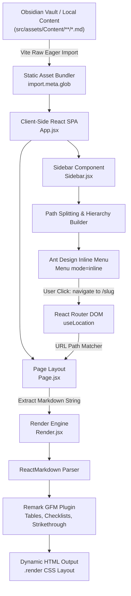

# This is a test file

this is how the test look in the site
 a personal documentation and project publishing platform built to solve a single problem:

> "I document my projects using Markdown and Obsidian, but publishing and maintaining that documentation through platforms like Medium gives me limited control over how my content is stored, organized, presented, and deployed. I want a system where I can write documentation locally, organize it project-wise, and automatically turn those Markdown files and their associated images into a publicly accessible website."

It's essentially a **Markdown-to-web documentation pipeline** — a system where the developer owns the content, controls the folder structure, writes documentation in the tool of their choice, and deploys the same content directly as a structured website.

---

## Architecture (Markdown-to-Web Pipeline)

---

## Tech Stack

|**Layer**|**Technology**|**Purpose**|
|---|---|---|
|Frontend|React 19 + Vite 8|SPA core framework with Hot Module Replacement and modern build tooling|
|UI Library|Ant Design 6.6 (`antd`)|Hierarchical collapsible sidebar navigation menu|
|Routing|React Router DOM 7.18|Client-side routing and dynamic URL pathname extraction|
|Markdown Parser|React Markdown 10.1|Converts raw Markdown text into native React component tree|
|Markdown Extensions|Remark GFM 4.0 (`remark-gfm`)|Adds support for GitHub Flavored Markdown (tables, checklists, autolinks, strikethrough)|
|Content Source|Obsidian Vault (`src/assets/Content`)|Local Markdown authoring environment with `.obsidian` workspace configs|
|Asset Bundling|Vite `import.meta.glob` (`?raw`, `eager: true`)|Static build-time discovery and eager loading of all nested `.md` files|
|Styling|Vanilla CSS|Clean minimal layout (`Render.css`, `Sidebar.css`, `index.css`) with AntD theme overrides|

---

## Data Flow (Pipeline)

The entire documentation platform operates on a reactive client-side pipeline:

1. **Authoring** — Technical notes, guides, and project logs are created locally as `.md` files in nested subfolders inside `src/assets/Content/` using Obsidian.
2. **Discovery & Ingestion** — Vite's `import.meta.glob("../assets/Content/**/*.md", { query: "?raw", import: "default", eager: true })` statically compiles all Markdown files into a key-value map (`path -> content`).
3. **Tree Hierarchy Construction** — `Sidebar.jsx` parses file paths relative to `Content/`, splits folder levels, and recursively constructs nested Ant Design `Menu` item trees (`key`, `label`, `children`).
4. **Navigation Trigger** — When a user selects a menu item, `Sidebar.jsx` invokes `navigate("/${pageName}")` with the document slug.
5. **Route & Content Resolution** — `Page.jsx` extracts `location.pathname`, decodes the URL component, searches the eagerly loaded files object for a matching filename, and extracts the raw Markdown string.
6. **Markdown to DOM Render** — `Render.jsx` receives the raw string, parses it using `ReactMarkdown` with `remark-gfm`, and renders styled HTML into a dedicated scrollable viewport.

---

## Frontend Structure & Components

|**Component**|**File Path**|**Responsibility**|
|---|---|---|
|`App.jsx`|`src/App.jsx`|Root layout container wrapped in `<BrowserRouter>`; coordinates flex split-screen layout between `<Sidebar />` and `<Page />`|
|`Sidebar.jsx`|`src/Sidebar/Sidebar.jsx`|Discovers content files, builds multi-level recursive navigation hierarchy, and renders the Ant Design `<Menu mode="inline" />`|
|`Page.jsx`|`src/Page/Page.jsx`|Reads active route via `useLocation()`, searches globbed Markdown file dictionary for the selected page, and passes raw content to `<Render />`|
|`Render.jsx`|`src/Render/Render.jsx`|Markdown renderer wrapping `ReactMarkdown` with `remarkGfm` plugin and applying typography styles via `Render.css`|

---

## Key Observations

- **Zero-Backend Architecture** — Pure client-side static application; all Markdown content is bundled at build time with no database or external API dependencies required.
- **Direct Obsidian Coupling** — The `src/assets/Content` directory functions directly as an Obsidian vault (containing `.obsidian/` configs), enabling seamless local writing and instant web rendering.
- **Automated Directory Tree Generation** — Adding a new folder or `.md` file inside `Content/` automatically generates corresponding submenus in the UI without modifying any React code.
- **Basename URL Routing** — Routes currently match based on the file's basename (`/{pageName}`), enabling clean URLs for top-level and nested notes.
- **Custom Ant Design Theming** — `Sidebar.css` overrides Ant Design default backgrounds with transparent borders and clean dark borders for a minimal modern look.
- **Static Hosting Ready** — Optimized for one-click deployment on Netlify, Vercel, or GitHub Pages as a static Vite SPA.