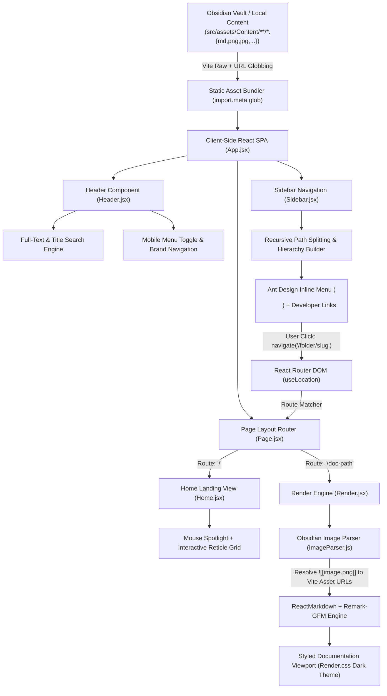

# CodeJournal

> **Automated, Zero-Backend Markdown-to-Web Documentation Platform**

[](https://abhay-codejournal.netlify.app/)
[](https://react.dev/)
[](https://vitejs.dev/)
[](https://ant.design/)
[](https://abhay-codejournal.netlify.app/)

**CodeJournal** is a developer-centric technical documentation and project publishing platform. It transforms local Markdown notes written in Obsidian into a fast, responsive, and visually refined website—without requiring a database, CMS, or backend server.

---

## 📌 Problem Statement

> *"I document my projects using Markdown and Obsidian, but publishing and maintaining that documentation through platforms like Medium gives me limited control over how my content is stored, organized, presented, and deployed. I want a system where I can write documentation locally, organize it project-wise, and automatically turn those Markdown files and their associated images into a publicly accessible website."*

CodeJournal bridges the gap between local note-taking and the web by providing an automated client-side compilation and rendering pipeline.

---

## 🚀 Key Features

- **Direct Obsidian Vault Integration**: `src/assets/Content/` serves as an active Obsidian Vault with `.obsidian` configurations for local writing and instant web sync.
- **Obsidian Wikilink Image Parser (`ImageParser.js`)**: Automatically intercepts and resolves Obsidian image embeds (`![[image.png]]`) to Vite-bundled hashed static asset URLs.
- **Instant Full-Text & Title Search**: Client-side modal search searching both document filenames and raw note contents with zero latency.
- **Deep Hierarchical Nested Routing**: Preserves multi-level folder structures with clean, semantic URL paths (e.g., `/Node & Express/Notes-Node`).
- **Interactive Dark Editorial Landing Page**: Cursor-tracking spotlight canvas (`--x`, `--y`), technical crosshair grid background (`SYS.LOC` reticle motif), typography intro, and author bio.
- **Refined Dark Luxury Design Tokens**: Cohesive aesthetic powered by gold accents (`#c9a96e`), Google Fonts (`Source Serif 4`, `JetBrains Mono`, `IBM Plex Sans`), code blocks, styled blockquotes, and zebra-striped tables.
- **Mobile Responsive Drawer**: Off-canvas sliding sidebar with backdrop blur overlay.
- **Automated CI/CD**: Seamless GitHub integration deployed automatically via Netlify.

---

## 🔄 The Obsidian-to-Site Data Flow

The entire platform operates on an automated static bundling pipeline:



### Step-by-Step Pipeline:

1. **Authoring in Obsidian**:
   Create or edit `.md` files and paste screenshots inside `src/assets/Content/` using Obsidian.
2. **Compile-Time Asset Ingestion**:
   - `import.meta.glob("../assets/Content/**/*.md", { query: "?raw", eager: true })` loads all Markdown files as raw strings.
   - `import.meta.glob("../assets/Content/**/*.{png,jpg,jpeg,gif,svg,webp}", { eager: true, query: "?url" })` discovers and hashes all media assets.
3. **Menu Tree & Search Indexing**:
   - `Sidebar.jsx` parses folder paths relative to `Content/` and dynamically generates nested Ant Design menu items with file and folder icons.
   - `Header.jsx` indexes document titles and Markdown contents for real-time live filtering.
4. **Dynamic Route Lookup**:
   - When a note is clicked, React Router navigates to the nested path (e.g. `/{category}/{note}`).
   - `Page.jsx` matches `useLocation().pathname` against the bundled file list.
5. **Wikilink Image Preprocessing**:
   - `ImageParser.js` regex searches for `![[filename.png]]` patterns and maps them to the hashed Vite asset URL.
6. **DOM Rendering & Typography**:
   - `ReactMarkdown` processes the enriched Markdown with `remark-gfm` (supporting tables, checklists, strikethrough, autolinks) and renders into a dark editorial typography viewport.

---

## 🛠️ Tech Stack

| Layer | Technology | Purpose |
|---|---|---|
| **Frontend Framework** | React 19 + Vite 8 | Single Page Application with Hot Module Replacement |
| **UI Components** | Ant Design 6.6 (`antd`) | Collapsible recursive tree navigation menu |
| **Icons** | React Icons 5.7 (`react-icons/fi`) | Feather iconography for UI, navigation, and folders |
| **Routing** | React Router DOM 7.18 | Dynamic client-side nested route resolution |
| **Markdown Engine** | React Markdown 10.1 + Remark GFM 4.0 | Markdown AST to React element rendering |
| **Image Resolution** | Custom Regex (`ImageParser.js`) | Resolves Obsidian wikilinks `![[...]]` to Vite assets |
| **Content Authoring** | Obsidian Vault (`src/assets/Content/`) | Local writing environment with `.obsidian` configurations |
| **Styling** | Vanilla CSS Design Tokens | Refined dark palette (`#0e0e10`, `#c9a96e`), Google Fonts |
| **Deployment** | Netlify | Continuous deployment from GitHub |

---

## 📂 Project Directory Structure

```text
CodeJournal/
├── MonarchDocs/
│   ├── public/
│   ├── src/
│   │   ├── assets/
│   │   │   └── Content/               # Embedded Obsidian Vault
│   │   │       ├── .obsidian/         # Obsidian workspace configurations
│   │   │       ├── Langchain/         # Technical notes category
│   │   │       ├── langgraph/         # Technical notes category
│   │   │       ├── Node & Express/    # Technical notes category
│   │   │       └── images/            # Embedded screenshot assets
│   │   ├── Header/
│   │   │   ├── Header.jsx             # Top bar + full-text search modal
│   │   │   └── Header.css             # Dark header styling
│   │   ├── Home/
│   │   │   ├── Home.jsx               # Interactive cursor spotlight landing page
│   │   │   └── Home.css               # Grid canvas + reticle crosshair styles
│   │   ├── Page/
│   │   │   └── Page.jsx               # Route listener & document matcher
│   │   ├── Parser/
│   │   │   └── ImageParser.js         # Obsidian wikilink image resolver
│   │   ├── Render/
│   │   │   ├── Render.jsx             # ReactMarkdown presentation wrapper
│   │   │   └── Render.css             # Dark typography, tables, and code styles
│   │   ├── Sidebar/
│   │   │   ├── Sidebar.jsx            # Dynamic recursive directory tree menu
│   │   │   └── Sidebar.css            # Ant Design theme overrides & drawer styles
│   │   ├── App.jsx                    # Root layout & drawer state coordinator
│   │   ├── index.css                  # Global design tokens & font imports
│   │   └── main.jsx                   # React root entrypoint
│   ├── index.html
│   ├── package.json
│   └── vite.config.js
└── README.md
```

---

## 💻 Getting Started Locally

### Prerequisites
- Node.js (v18 or higher)
- npm or yarn

### Installation & Run

1. **Clone the repository**:
   ```bash
   git clone https://github.com/MONARCH1108/CodeJournal.git
   cd CodeJournal/MonarchDocs
   ```

2. **Install dependencies**:
   ```bash
   npm install
   ```

3. **Start the development server**:
   ```bash
   npm run dev
   ```

4. **Build for production**:
   ```bash
   npm run build
   ```

---

## ✍️ Authoring Notes in Obsidian

1. Open **Obsidian** on your desktop.
2. Select **"Open folder as vault"** and point to:
   ```text
   <path-to-repo>/MonarchDocs/src/assets/Content
   ```
3. Create folders and `.md` notes. Paste screenshots directly into notes.
4. Run `npm run dev` or push to GitHub—your documentation and images will render automatically!

---

## 🔗 Links & Author

- **Live Application**: [https://abhay-codejournal.netlify.app/](https://abhay-codejournal.netlify.app/)
- **Author**: Abhay ([Portfolio](https://abhayemani.netlify.app/) | [GitHub](https://github.com/MONARCH1108) | [LinkedIn](https://www.linkedin.com/in/e-y-s-v-s-abhay))
